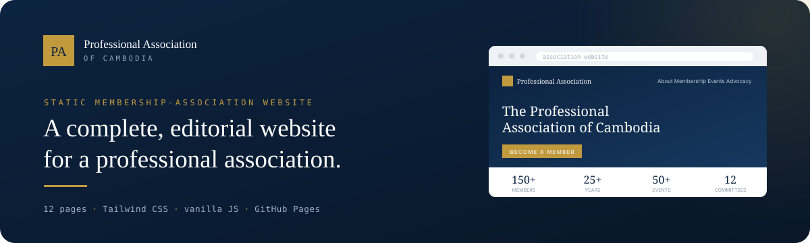
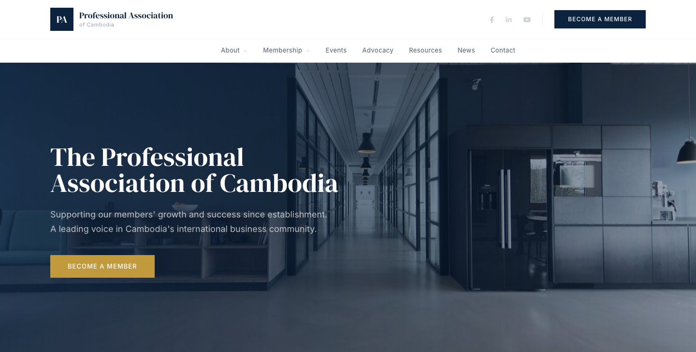
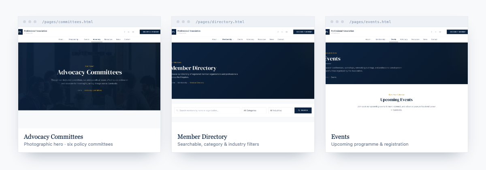
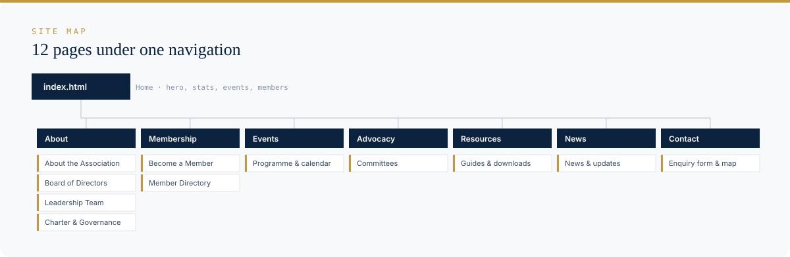

<p align="center">
  
</p>

<p align="center">
  A polished, ready-to-deploy website for a professional membership association or chamber of commerce —<br>
  twelve hand-built pages, no build step, and free hosting on GitHub Pages.
</p>

---

## The site

<p align="center">
  
</p>

An editorial, executive-grade design in deep navy and gold: DM Serif Display headlines, Inter body copy, a sticky
dropdown navigation, an animated hero, scroll-reveal sections, count-up statistics, and a member-logo marquee.

## Every page carries the same design language

<p align="center">
  
</p>

## What it is

`association-website` is a **static website template** for a professional or business association. It is written in plain
HTML with [Tailwind CSS](https://tailwindcss.com) for styling and a small amount of vanilla JavaScript for interaction —
no framework, no bundler, no server. Clone it, replace the placeholder copy and imagery, and publish it straight to
GitHub Pages. The design is modelled on the polished house style of international chambers of commerce.

## Pages at a glance

<p align="center">
  
</p>

| Section | Pages |
| --- | --- |
| **Home** | `index.html` — hero, about, statistics, featured events, advocacy, member marquee |
| **About** | About the Association · Board of Directors · Leadership Team · Charter & Governance |
| **Membership** | Become a Member · Member Directory (searchable, with filters) |
| **Events** | Programme & calendar of upcoming events |
| **Advocacy** | Advocacy Committees |
| **Resources** | Guides & downloads |
| **News** | News & updates |
| **Contact** | Enquiry form & contact details |

## Design system

The look is defined once and reused across all pages. The tokens live in the Tailwind config inside each HTML file.

| Role | Token | Hex |
| --- | --- | --- |
| Primary (navy) | `primary` | `#0c2340` |
| Deep navy | `dark` | `#091728` |
| Secondary (steel) | `secondary` | `#1a5276` |
| Accent (gold) | `accent` | `#c19a3e` |
| Light surface | `light` | `#f8f9fb` |

- **Type** — `DM Serif Display` for headlines, `Inter` for UI and body copy.
- **Motif** — square corners, uppercase gold eyebrows, and a 60px gold hairline divider under section titles.
- **Motion** — scroll-reveal, Ken Burns hero, count-up numbers, and a paused-on-hover logo marquee (`css/styles.css`, `js/main.js`).

## Built with

- **HTML5** — one file per page, no templating
- **Tailwind CSS** — loaded via CDN, configured inline per page
- **Vanilla JavaScript** — `js/main.js` (nav, mobile menu, reveals, counters, marquee)
- **Font Awesome** & **Google Fonts** — icons and typefaces via CDN
- **GitHub Pages** — static hosting, no build pipeline

## Run it locally

No build step. Because styles, fonts, and icons load from a CDN, serve the folder with a live connection:

```bash
git clone https://github.com/xidik12/association-website.git
cd association-website
python3 -m http.server 8000
# open http://localhost:8000
```

## Deploy to GitHub Pages

1. Fork or push this repository to your GitHub account.
2. Open **Settings → Pages**.
3. Under **Build and deployment**, choose **Deploy from a branch** and select the branch and `/ (root)` folder.
4. Save — your site publishes at `https://<user>.github.io/association-website/`.

## Customize

- Replace the placeholder text, statistics, and contact details (e.g. `+855 23 XXX XXX`, `[Building Name]`) with real content.
- Swap the hero and section imagery for your own photographs.
- Adjust brand colours and fonts in the `tailwind.config` block at the top of each HTML file.
- Update navigation links and the footer in every page's header and footer blocks.

## Project structure

```text
association-website/
├── index.html          # Homepage
├── css/styles.css      # Custom styles, animations, buttons
├── js/main.js          # Nav, reveals, counters, marquee
└── pages/              # About, Board, Team, Charter, Membership,
                        # Directory, Events, Committees, Resources,
                        # News, Contact
```

## Notes

- All copy, figures, and imagery ship as **demo placeholders** — review and replace them before going live.
- Tailwind is loaded from the CDN for zero-config editing; compile Tailwind if you need a fully self-hosted production build.

## License

No license file is currently included in this repository. All rights reserved by the owner unless a license is added.
